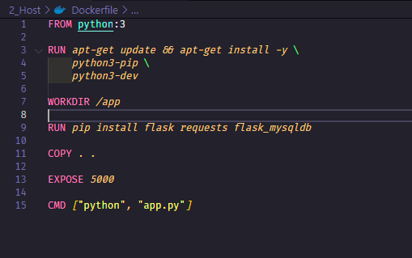

# Estabelecendo conexão entre containers

- Podemos estabelecer conexão entre containers, para que um container possa acessar o outro.
- Vamos precisar de dois containers, um para o ´banco de dados´ e outro para a ´aplicação´.
- Para isso, precisamos criar uma ´network bridge´ e adicionar os containers a ela.
- Nosso container flask vai inserir dados no banco de dados MySQL que está em outro container.

## Criando projeto 3_Containers

Crie projeto `3_Containers`:

```bash

mkdir 3_Containers

cd 3_Containers

```

Vamos criar um diretório para o banco de dados e outro para a aplicação.

```bash

mkdir Flask

mkdir MySQL

```


## Criando uma imagem de flask

Flask é um microframework para Python utilizado para criar aplicações web.

### Criando Dockerfile

```dockerfile

FROM python:3

RUN apt-get update && apt-get install -y \
    python3-pip \
    python3-dev    

WORKDIR /app

RUN pip install flask requests flask_mysqldb

COPY . .

EXPOSE 5000

CMD ["python", "app.py"]

```



### Criando app.py

```python

import flask
from flask import request, json, jsonify
import requests
import flask_mysqldb
from flask_mysqldb import MySQL


app = flask.Flask(__name__)
app.config["DEBUG"] = True

app.config['MYSQL_HOST'] = 'mysql_api_container' // Nome do container
app.config['MySQL_USER'] = 'root'
app.config['MySQL_PASSWORD'] = ''
app.config['MySQL_DB'] = 'flaskdocker'

mysql = MySQL(app)


@app.route('/', methods=['GET'])
def index():
    data = requests.get('http://randomuser.me/api')
    return data.json()

@app.route('/inserthost', methods=['POST'])
def inserthost():
    data = request.get('http://randomuser.me/api').json()
    username = data['results'][0]['name']['first']

    cur = mysql.connection.cursor()
    cur.execute("INSERT INTO host (name) VALUES (%s)", (username))
    mysql.connection.commit()
    cur.close()

if __name__ == "__main__":
    app.run(host="0.0.0.0", debug=True, port="5000")


```


### Buildando a imagem

```bash

docker build -t flaskapinetwork .

```

Explicando o comando:

- `docker build` - Comando para buildar a imagem
- `-t` - Tag da imagem
- `flaskapinetwork` - Nome da imagem
- `.` - Diretório onde está o Dockerfile

## Criando uma imagem de MySQL

### Criando Dockerfile de MySQL

```dockerfile

FROM mysql:5.7

COPY schema.sql /docker-entrypoint-initdb.d/

EXPOSE 3306

VOLUME ["/backup/"]

```


### Criando schema.sql

```sql

CREATE DATABASE flaskdocker;
USE flaskdocker;

CREATE TABLE flaskdocker (
    id INT NOT NULL AUTO_INCREMENT,
    name VARCHAR(100) NOT NULL,    
    PRIMARY KEY (id)
);

```


### Buildando a imagem de MySQL

```bash

cd MySQL

docker build -t mysqlnetworkapi .

```

Explicando o comando:

- `docker build` - Comando para buildar a imagem
- `-t` - Tag da imagem
- `mysqlnetworkapi` - Nome da imagem
- `.` - Diretório onde está o Dockerfile

## Criando uma network bridge

```bash

docker network create --driver bridge flasknetwork

```

Explicando o comando:

- `docker network create` - Comando para criar uma network
- `--driver bridge` - Driver da network
- `flasknetwork` - Nome da network


## Imagens e network criadas

```bash

docker images

docker network ls

```


## Rodando os containers

```bash

docker run -d -p 5000:5000 --name flaska_api_container --rm --network flasknetwork flaskapinetwork 

docker run -d -p 3306:3306 --name mysql_api_container --rm --network flasknetwork -e MYSQL_ALLOW_EMPTY_PASSWORD=true mysqlnetworkapi

```


## Testando a conexão

```bash

docker exec -it mysql_api_container bash

mysql -u root -p

show databases;

use flaskdocker;

show tables;

select * from flaskdocker;

```
