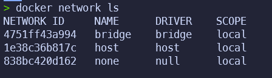

# Listando redes

## Listando redes

- Podemos listar as redes criadas no Docker com o comando `docker network ls`:

```bash

docker network ls

```

Exemplo de Retorno:

```text

NETWORK ID          NAME                DRIVER              SCOPE
b6b0b0b0b6b0        bridge              bridge              local
d0d0d0d0d0d0        host                host                local
a1a1a1a1a1a1        none                null                local

```



Explicando o comando:

- `docker network ls`: lista as redes criadas no Docker.

Explicando o retorno:

- `NETWORK ID`: é o ID da rede;
- `NAME`: é o nome da rede;
- `DRIVER`: é o driver da rede;  
- `SCOPE`: é o escopo da rede.

Os tipos de escopo são:

- `local`: a rede é visível apenas para o host;
- `swarm`: a rede é visível para todos os hosts que estão no swarm.
- `global`: a rede é visível para todos os hosts que estão no swarm, e os containers que estão conectados a essa rede podem se comunicar entre si.
- `none`: a rede não é visível para nenhum host.
- `host`: a rede é visível para todos os hosts que estão no swarm, e os containers que estão conectados a essa rede podem se comunicar entre si.
- `bridge`: a rede é visível para todos os hosts que estão no swarm, e os containers que estão conectados a essa rede podem se comunicar entre si.
- `overlay`: a rede é visível para todos os hosts que estão no swarm, e os containers que estão conectados a essa rede podem se comunicar entre si.
- `macvlan`: a rede é visível para todos os hosts que estão no swarm, e os containers que estão conectados a essa rede podem se comunicar entre si.
- `ipvlan`: a rede é visível para todos os hosts que estão no swarm, e os containers que estão conectados a essa rede podem se comunicar entre si.
- `vxlan`: a rede é visível para todos os hosts que estão no swarm, e os containers que estão conectados a essa rede podem se comunicar entre si.
- `p2p`: a rede é visível para todos os hosts que estão no swarm, e os containers que estão conectados a essa rede podem se comunicar entre si.
- `routing mesh`: a rede é visível para todos os hosts que estão no swarm, e os containers que estão conectados a essa rede podem se comunicar entre si.
- `ingress`: a rede é visível para todos os hosts que estão no swarm, e os containers que estão conectados a essa rede podem se comunicar entre si.
- `docker_gwbridge`: a rede é visível para todos os hosts que estão no swarm, e os containers que estão conectados a essa rede podem se comunicar entre si.