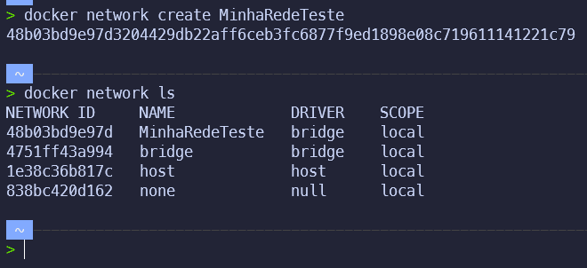
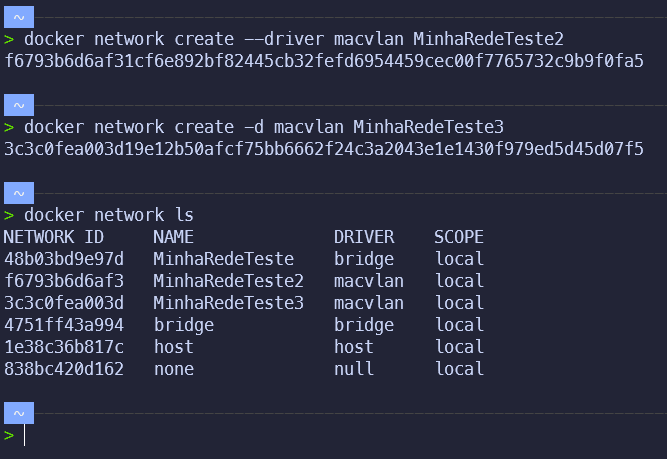

# Criando rede

Índice:

- [Criando rede](#criando-rede)
  - [Criando uma rede](#criando-uma-rede)
  - [Criando uma rede com o driver específico](#criando-uma-rede-com-o-driver-específico)

## Criando uma rede

- Para criar uma rede, podemos utilizar o comando `docker network create <nome_da_rede>`:

```bash

docker network create MinhaRedeteste

```

Explique o comando:

- `docker network create`: cria uma rede no Docker.
- `MinhaRedeteste`: nome da rede que será criada.


```bash

docker network create --driver bridge MinhaRedeteste

```

- Esta rede será criada com o driver `bridge`, que é o driver padrão do Docker.
- Podemos criar diversas redes, e cada container pode ser conectado a uma ou mais redes.


Podemos verificar que a rede foi criada com o comando `docker network ls`:

```bash

docker network ls

```

Exemplo de Retorno:

```text

NETWORK ID          NAME                DRIVER              SCOPE
b6b0b0b0b6b0        bridge              bridge              local
d0d0d0d0d0d0        host                host                local
a1a1a1a1a1a1        none                null                local
e2e2e2e2e2e2        MinhaRedeteste      bridge              local

```



## Criando uma rede com o driver específico

- Podemos criar uma rede com um driver específico, utilizando o parâmetro `--driver` ou `-d`:

```bash

docker network create --driver macvlan MinhaRedeteste

```

ou

```bash

docker network create -d macvlan MinhaRedeteste

```

- Esta rede será criada com o driver `macvlan`.
- Podemos verificar que a rede foi criada com o comando `docker network ls`:

```bash

docker network ls

```

