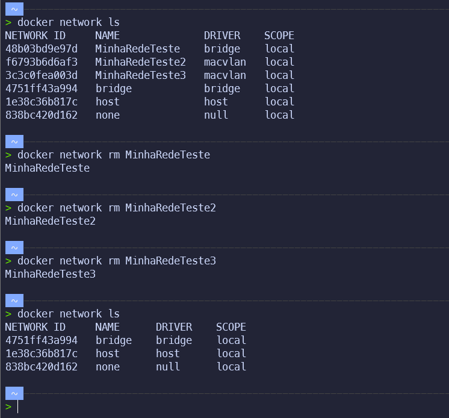
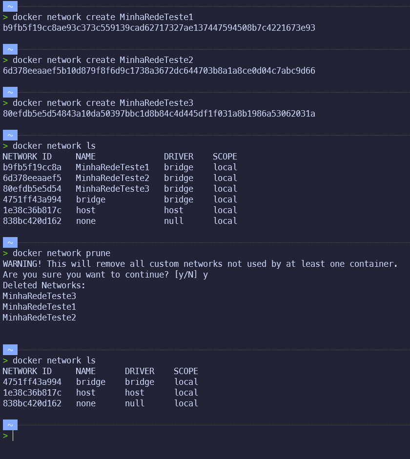

# Removendo Networks

## Removendo um network

- Para remover um network, basta executar o comando `docker network rm <nome do network>`

```bash

docker network rm <nome do network>

```



## Removendo todos os networks

- Para remover todos os networks, basta executar o comando `docker network prune`
- Receberá uma mensagem de confirmação, basta digitar `y` e apertar `Enter`

```bash

docker network prune

```



## Removendo todos os networks que não estão sendo utilizados

- Para remover todos os networks que não estão sendo utilizados, basta executar o comando `docker network prune --filter "dangling=true"`

```bash

docker network prune --filter "dangling=true"

```

## Removendo todos os networks que não estão sendo utilizados e que não são nativos

- Para remover todos os networks que não estão sendo utilizados e que não são nativos, basta executar o comando `docker network prune --filter "dangling=true" --filter "type=custom"`

```bash

docker network prune --filter "dangling=true" --filter "type=custom"

```

## Removendo todos os networks que não estão sendo utilizados e que não são nativos e que não são nativos

- Para remover todos os networks que não estão sendo utilizados e que não são nativos e que não são nativos, basta executar o comando `docker network prune --filter "dangling=true" --filter "type=custom" --filter "type=custom"`

```bash

docker network prune --filter "dangling=true" --filter "type=custom" --filter "type=custom"

```