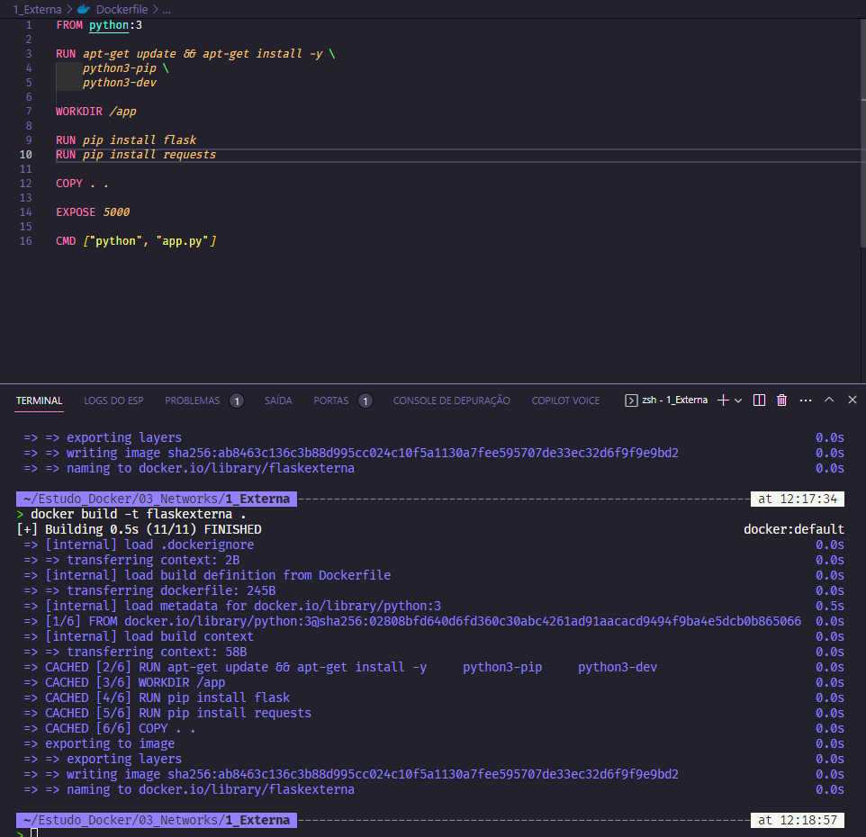
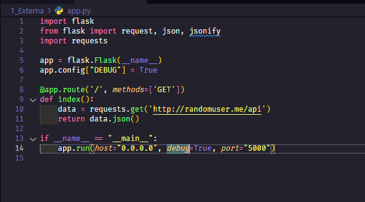
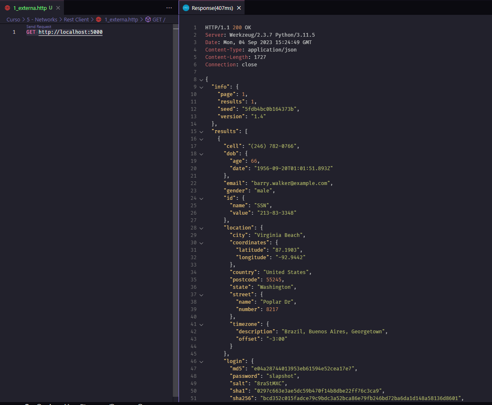
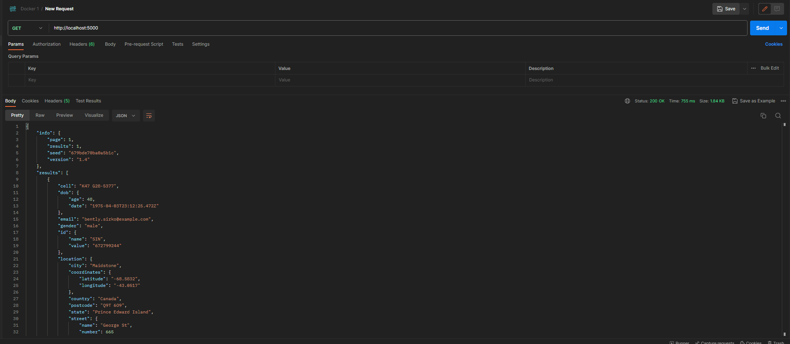

# Conexões Externas

- Os containers `podem se conectar com o mundo externo` através de portas expostas.
- As portas expostas podem ser acessadas através do `IP do host` ou do `IP do container`.

## Projeto 03_Networks


Crie projeto `03_Networks`:

```bash

mkdir 03_Networks

cd 03_Networks

mkdir 1_externa

cd 1_externa


```

## Criando uma imagem de flask

Flask é um microframework para Python utilizado para criar aplicações web.

### Criando Dockerfile

```dockerfile

FROM python:3

RUN apt-get update && apt-get install -y \
    python3-pip \
    python3-dev    

WORKDIR /app

RUN pip install flask
RUN pip install requests

COPY . .

EXPOSE 5000

CMD ["python", "app.py"]

```



### Criando app.py

```python
import flask

from flask import Flask request. json, jsonify

import requests

app = flask.Flask(__name__)
app.config["DEBUG"] = True

@app.route('/', methods=['GET'])

def index():
    data = requests.get('http://randomuser.me/api/')
    return data.json()

if __name__ == '__main__':
    app.run(host="0.0.0.0", debug=True, port=5000)

```



### Buildando a imagem

```bash

docker build -t flaskexterna .

```

Explicando o comando:

- `docker build` - Comando para buildar a imagem
- `-t` - Tag da imagem
- `flaskexterna` - Nome da imagem
- `.` - Diretório onde está o Dockerfile

### Rodando a imagem

```bash

docker run -d -p 5000:5000 --name flaskexternocontainer --rm flaskexterna
```

Explicando o comando:

- `docker run` - Comando para rodar a imagem
- `-d` - Rodar em background
- `-p` - Porta
- `5000:5000` - Porta do host:Porta do container
- `--name` - Nome do container
- `flaskexternocontainer` - Nome do container
- `--rm` - Remove o container quando ele é parado
- `flaskexterna` - Nome da imagem


### Testando a aplicação no navegador

```bash

curl http://localhost:5000

```

### Testando a aplicação com Rest Client

Crie um arquivo chamado `1_externa.http` e adicione o seguinte conteúdo:

```http

GET http://localhost:5000

```



### Testando a aplicação com Postman

Criando uma nova requisição GET com a URL `http://localhost:5000` 

