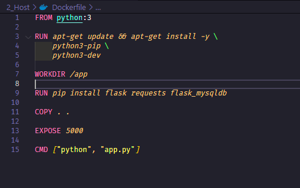
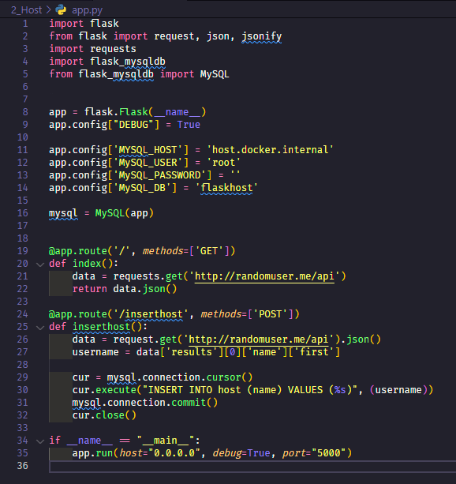

# Network com Conexão ao Host

- Podemos ´conectar o container com o host do docker´, para que o container tenha acesso a rede do host.
- ´Host´ é o computador que está rodando o docker.	
- Como o ip do host é dinâmico, podemos usar o nome ´host.docker.internal´ para acessar o host.

## Projeto 2_host

Para esse projeto precisamos possui o banco de dados MySQL rodando no host.

Crie projeto `2_host`:

```bash

mkdir 2_host

cd 2_host

```

## Criando uma imagem de flask

Flask é um microframework para Python utilizado para criar aplicações web.

### Criando Dockerfile

```dockerfile

FROM python:3

RUN apt-get update && apt-get install -y \
    python3-pip \
    python3-dev    

WORKDIR /app

RUN pip install flask requests flask_mysqldb

COPY . .

EXPOSE 5000

CMD ["python", "app.py"]

```



### Criando app.py

```python

import flask
from flask import request, json, jsonify
import requests
import flask_mysqldb
from flask_mysqldb import MySQL


app = flask.Flask(__name__)
app.config["DEBUG"] = True

app.config['MYSQL_HOST'] = 'host.docker.internal'
app.config['MySQL_USER'] = 'root'
app.config['MySQL_PASSWORD'] = ''
app.config['MySQL_DB'] = 'flaskhost'

mysql = MySQL(app)


@app.route('/', methods=['GET'])
def index():
    data = requests.get('http://randomuser.me/api')
    return data.json()

@app.route('/inserthost', methods=['POST'])
def inserthost():
    data = request.get('http://randomuser.me/api').json()
    username = data['results'][0]['name']['first']

    cur = mysql.connection.cursor()
    cur.execute("INSERT INTO host (name) VALUES (%s)", (username))
    mysql.connection.commit()
    cur.close()

if __name__ == "__main__":
    app.run(host="0.0.0.0", debug=True, port="5000")


```



### Buildando a imagem

```bash

docker build -t flaskhost .

```

Explicando o comando:

- `docker build` - Comando para buildar a imagem
- `-t` - Tag da imagem
- `flaskhost` - Nome da imagem
- `.` - Diretório onde está o Dockerfile

### Rodando a imagem

```bash

docker run -d -p 5000:5000 --name flaskhostcontainer --rm flaskhost
```

Explicando o comando:

- `docker run` - Comando para rodar a imagem
- `-d` - Rodar em background
- `-p` - Porta
- `5000:5000` - Porta do host:Porta do container
- `--name` - Nome do container
- `flaskhostcontainer` - Nome do container
- `--rm` - Remove o container quando ele é parado
- `flaskhost` - Nome da imagem

