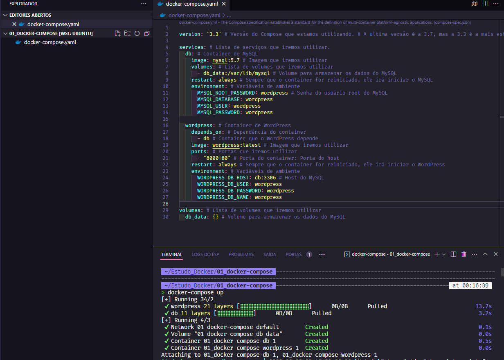
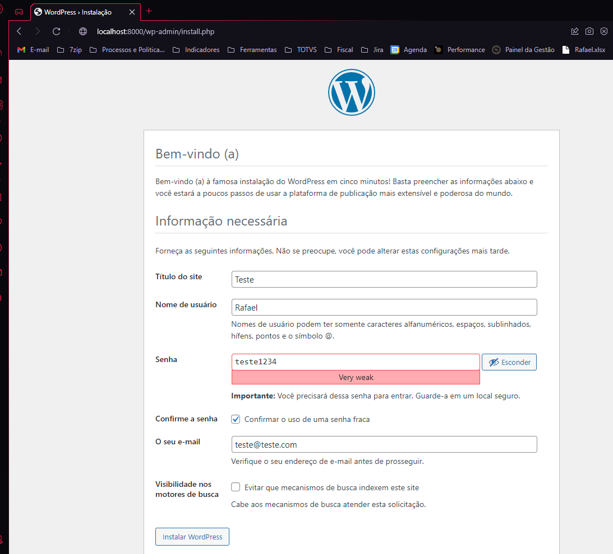
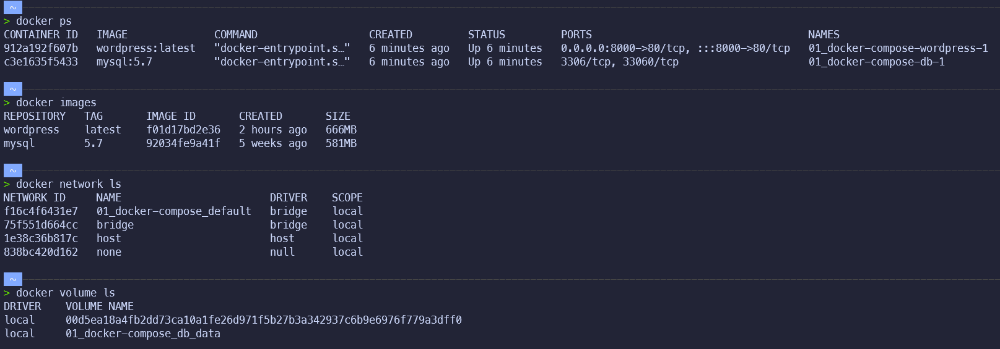
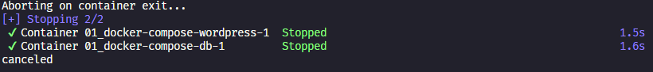
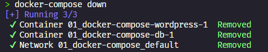
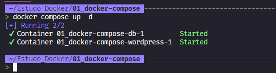

# Criando nosso primeiro arquivo Compose

## Índice

- [Criando nosso primeiro arquivo Compose](#criando-nosso-primeiro-arquivo-compose)
  - [Índice](#índice)
  - [Introdução](#introdução)
  - [Criando projeto](#criando-projeto)
  - [Criando arquivo Compose](#criando-arquivo-compose)
  - [Executando o Compose em modo interativo](#executando-o-compose-em-modo-interativo)
  - [Verificando imagens, containers, volumes e redes](#verificando-imagens-containers-volumes-e-redes)
  - [Parando a execução do Compose](#parando-a-execução-do-compose)
  - [Executando o Compose em modo background](#executando-o-compose-em-modo-background)

## Introdução

O Compose é uma ferramenta para definir e executar aplicativos Docker de vários contêineres. Com o Compose, usamos um arquivo YAML para configurar os serviços do aplicativo. Em seguida, com um único comando, você cria e inicia todos os serviços de contêineres a partir da sua configuração.

## Criando projeto

Vamos criar um diretório para nosso projeto:

```bash

mkdir docker-compose && cd docker-compose

```

## Criando arquivo Compose

Vamos criar na raiz do projeto um arquivo chamado `docker-compose.yml`:

```yaml

version: '3.3' # Versão do Compose que estamos utilizando.


services: # Lista de serviços que iremos utilizar.
  db: # Container de MySQL
    image: mysql:5.7 # Imagem que iremos utilizar
    volumes: # Lista de volumes que iremos utilizar
      - db_data:/var/lib/mysql # Volume para armazenar os dados do MySQL
    restart: always # Sempre que o container for reiniciado, ele irá iniciar o MySQL
    environment: # Variáveis de ambiente
      MYSQL_ROOT_PASSWORD: wordpress # Senha do usuário root do MySQL
      MYSQL_DATABASE: wordpress
      MYSQL_USER: wordpress
      MYSQL_PASSWORD: wordpress

  wordpress: # Container de WordPress
    depends_on: # Dependência do container
      - db # Container que o WordPress depende
    image: wordpress:latest # Imagem que iremos utilizar
    ports: # Portas que iremos utilizar
      - "8000:80" # Porta do container: Porta do host
    restart: always # Sempre que o container for reiniciado, ele irá iniciar o WordPress
    environment: # Variáveis de ambiente
      WORDPRESS_DB_HOST: db:3306 # Host do MySQL
      WORDPRESS_DB_USER: wordpress
      WORDPRESS_DB_PASSWORD: wordpress
      WORDPRESS_DB_NAME: wordpress

volumes: # Lista de volumes que iremos utilizar
  db_data: {} # Volume para armazenar os dados do MySQL

```

Este arquivo ira coordenar os containers e imagens que iremos utilizar.

As chaves mais importantes são:

- `version`: Versão do Compose que estamos utilizando.
- `services`: Lista de serviços que iremos utilizar.
- `Volumes`: Lista de volumes que iremos utilizar.

## Executando o Compose em modo interativo

Para executar o Compose, basta executar o comando:

```bash

docker-compose up

```

Onde:

- `up`: Executa o Compose.

O Compose irá criar os containers e volumes que definimos no arquivo `docker-compose.yml`.

Para parar a execução do Compose podemos utilizar `ctrl + c` ou executar o comando:

```bash

docker-compose down

```



No navegador, acesse `localhost:8000` e você verá a tela de instalação do WordPress.


## Verificando imagens, containers, volumes e redes

Podemos verificar as imagens criadas pelo Compose com o comando `docker images`:

```bash

docker images

```

Para verificar os containers criados pelo Compose, podemos utilizar o comando `docker ps`:

```bash

docker ps

```

Para verificar os volumes criados pelo Compose, podemos utilizar o comando `docker volume ls`:

```bash

docker volume ls

```

Para verificar as redes criadas pelo Compose, podemos utilizar o comando `docker network ls`:

```bash

docker network ls

```



Podemos observar que o Compose criou os containers, imagens, volumes e redes que definimos no arquivo `docker-compose.yml`.

Nome dos containers criados pelo Compose:

- `01_docker-compose-wordpress-1`: Container do MySQL.
- `01_docker-compose-db-1`: Container do WordPress.

Estes nomes são gerados automaticamente pelo Compose e são baseados no nome do diretório onde o arquivo `docker-compose.yml` está localizado e no nome do serviço definido no arquivo `docker-compose.yml`.

É possível definir o nome do container no arquivo `docker-compose.yml` utilizando a chave `container_name`.

```yaml

version: '3.3' # Versão do Compose que estamos utilizando.

services: # Lista de serviços que iremos utilizar.
  db: # Container de MySQL
    image: mysql:5.7 # Imagem que iremos utilizar
    volumes: # Lista de volumes que iremos utilizar
      - db_data:/var/lib/mysql # Volume para armazenar os dados do MySQL
    restart: always # Sempre que o container for reiniciado, ele irá iniciar o MySQL
    environment: # Variáveis de ambiente
      MYSQL_ROOT_PASSWORD: wordpress # Senha do usuário root do MySQL
      MYSQL_DATABASE: wordpress
      MYSQL_USER: wordpress
      MYSQL_PASSWORD: wordpress
    container_name: mysql # Nome do container

  wordpress: # Container de WordPress
    depends_on: # Dependência do container
      - db # Container que o WordPress depende
    image: wordpress:latest # Imagem que iremos utilizar
    ports: # Portas que iremos utilizar
      - "8000:80" # Porta do container: Porta do host
    restart: always # Sempre que o container for reiniciado, ele irá iniciar o WordPress
    environment: # Variáveis de ambiente
      WORDPRESS_DB_HOST: db:3306 # Host do MySQL
      WORDPRESS_DB_USER: wordpress
      WORDPRESS_DB_PASSWORD: wordpress
      WORDPRESS_DB_NAME: wordpress
    container_name: wordpress # Nome do container

```

## Parando a execução do Compose

Para parar a execução do Compose podemos utilizar `ctrl + c` ou executar o comando:

```bash

docker-compose down

```

Onde:

- `down`: Para a execução do Compose.

`ctrl + c`


`docker-compose down`


Podemos observar que o Compose parou os containers, imagens, volumes e redes que definimos no arquivo `docker-compose.yml`.

## Executando o Compose em modo background

O Compose pode ser executado em modo background, ou seja, ele irá executar em segundo plano.

Para isso precisamos utilizar a flag `-d`.

Exemplo:

```bash

docker-compose up -d

```

Onde:

- `up`: Executa o Compose.
- `-d`: Executa o Compose em modo background.

