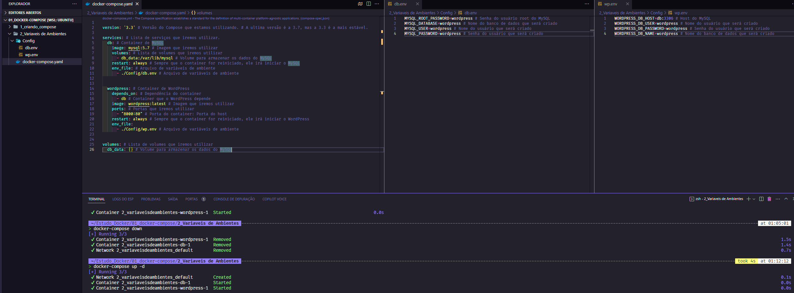

# Variáveis de Ambiente no Compose

## Índice

- [Variáveis de Ambiente no Compose](#variáveis-de-ambiente-no-compose)
  - [Índice](#índice)
  - [Introdução](#introdução)
  - [Variáveis de Ambiente](#variáveis-de-ambiente)
  - [Arquivo env\_file](#arquivo-env_file)
  - [Criando arquivo env\_file para o MySQL](#criando-arquivo-env_file-para-o-mysql)
  - [Criando arquivo env\_file para o WordPress](#criando-arquivo-env_file-para-o-wordpress)


## Introdução

Neste documento iremos aprender como utilizar variáveis de ambiente no Compose.

## Variáveis de Ambiente

Variáveis de ambiente são variáveis que podem ser utilizadas dentro de um container.

Podemos utilizar variáveis de ambiente para definir configurações de um container, como por exemplo, a porta que o container irá utilizar.

Também podemos utilizar variáveis de ambiente no docker-compose.yml para definir configurações de um serviço.

## Arquivo env_file

Para utilizar variáveis de ambiente no Compose, precisamos criar um arquivo chamado `.env` na mesma pasta onde está o arquivo `docker-compose.yml`.

O arquivo de extensão `.env` é um arquivo de texto que contém variáveis de ambiente no formato `NOME=VALOR`.

As variáveis podem ser chamadas no arquivo `docker-compose.yml` utilizando a sintaxe `${VARIAVEL}`.

Esta técnica é muito útil para definir configurações que podem variar de acordo com o ambiente, como por exemplo, a porta que o container irá utilizar ou para `dados sensíveis, como por exemplo, senhas`.

Este arquivo deve conter apenas texto, não deve conter espaços entre o nome da variável e o sinal de igual `=` e não deve conter espaços entre o sinal de igual `=` e o valor da variável.

Para comentar uma linha no arquivo `.env`, podemos utilizar o caractere `#`.

## Criando arquivo env_file para o MySQL

Vamos criar um diretório chamado Config e dentro dele vamos criar um arquivo chamado `db.env`:

```bash

mkdir Config && cd Config

touch db.env

```

Agora vamos adicionar as seguintes variáveis de ambiente no arquivo `db.env`:

```bash

MYSQL_ROOT_PASSWORD=wordpress # Senha do usuário root do MySQL
MYSQL_DATABASE=wordpress # Nome do banco de dados que será criado
MYSQL_USER=wordpress # Nome do usuário que será criado
MYSQL_PASSWORD=wordpress # Senha do usuário que será criado

```

No arquivo `docker-compose.yml`, vamos adicionar a chave `env_file` dentro do serviço `db`, substituindo a chave `environment`:

```yaml

version: '3.3' # Versão do Compose que estamos utilizando. # A ultima versão é a 3.7, mas a 3.3 é a mais estável.

services: # Lista de serviços que iremos utilizar.
  db: # Container de MySQL
    image: mysql:5.7 # Imagem que iremos utilizar
    volumes: # Lista de volumes que iremos utilizar
      - db_data:/var/lib/mysql # Volume para armazenar os dados do MySQL
    restart: always # Sempre que o container for reiniciado, ele irá iniciar o MySQL
    env_file: # Arquivo de variáveis de ambiente
      - ./Config/db.env # Arquivo de variáveis de ambiente


  wordpress: # Container de WordPress
    depends_on: # Dependência do container
      - db # Container que o WordPress depende
    image: wordpress:latest # Imagem que iremos utilizar
    ports: # Portas que iremos utilizar
      - "8000:80" # Porta do container: Porta do host
    restart: always # Sempre que o container for reiniciado, ele irá iniciar o WordPress
    environment: # Variáveis de ambiente
      WORDPRESS_DB_HOST: db:3306 # Host do MySQL
      WORDPRESS_DB_USER: wordpress
      WORDPRESS_DB_PASSWORD: wordpress
      WORDPRESS_DB_NAME: wordpress

volumes: # Lista de volumes que iremos utilizar
  db_data: {} # Volume para armazenar os dados do MySQL

```

Agora vamos executar o Compose em modo interativo:

```bash

docker-compose up -d

```


## Criando arquivo env_file para o WordPress

Vamos criar um diretório chamado Config e dentro dele vamos criar um arquivo chamado `wp.env`:

```bash

mkdir Config && cd Config

touch wp.env

```

Agora vamos adicionar as seguintes variáveis de ambiente no arquivo `wp.env`:

```yaml


version: '3.3' # Versão do Compose que estamos utilizando. # A ultima versão é a 3.7, mas a 3.3 é a mais estável.

services: # Lista de serviços que iremos utilizar.
  db: # Container de MySQL
    image: mysql:5.7 # Imagem que iremos utilizar
    volumes: # Lista de volumes que iremos utilizar
      - db_data:/var/lib/mysql # Volume para armazenar os dados do MySQL
    restart: always # Sempre que o container for reiniciado, ele irá iniciar o MySQL
    env_file: # Arquivo de variáveis de ambiente
      - ./Config/db.env # Arquivo de variáveis de ambiente


  wordpress: # Container de WordPress
    depends_on: # Dependência do container
      - db # Container que o WordPress depende
    image: wordpress:latest # Imagem que iremos utilizar
    ports: # Portas que iremos utilizar
      - "8000:80" # Porta do container: Porta do host
    restart: always # Sempre que o container for reiniciado, ele irá iniciar o WordPress
    env_file:
      - ./Config/wp.env # Arquivo de variáveis de ambiente


volumes: # Lista de volumes que iremos utilizar
  db_data: {} # Volume para armazenar os dados do MySQL

```

