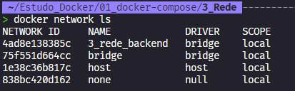

# Utilizando Networks no Docker Compose

## Introdução

Neste documento iremos aprender como utilizar Networks no Docker Compose.

O Compose possui um recurso chamado Networks que permite que os containers se comuniquem entre si.

O compose cria uma rede básica Bridge para cada projeto, mas também podemos criar nossas próprias redes.

Podemos isolas os containers em redes diferentes, ou podemos colocar os containers em uma mesma rede para que eles possam se comunicar entre si. Para isso, basta adicionar a opção `networks` no arquivo `docker-compose.yml`.

Também podemos `definir drivers de rede` para cada rede que criarmos.

## Criando uma rede no Compose

Vamos criar uma rede no Compose para que os containers possam se comunicar entre si.

Para isso, vamos adicionar a opção `networks` no arquivo `docker-compose.yml`:

```yaml

version: '3.3' # Versão do Compose que estamos utilizando. # A ultima versão é a 3.7, mas a 3.3 é a mais estável.

services: # Lista de serviços que iremos utilizar.
  db: # Container de MySQL
    image: mysql:5.7 # Imagem que iremos utilizar
    volumes: # Lista de volumes que iremos utilizar
      - db_data:/var/lib/mysql # Volume para armazenar os dados do MySQL
    restart: always # Sempre que o container for reiniciado, ele irá iniciar o MySQL
    env_file: # Arquivo de variáveis de ambiente
      - ./Config/db.env # Arquivo de variáveis de ambiente
    networks: # Lista de redes que iremos utilizar
      - backend # Rede que iremos utilizar


  wordpress: # Container de WordPress
    depends_on: # Dependência do container
      - db # Container que o WordPress depende
    image: wordpress:latest # Imagem que iremos utilizar
    ports: # Portas que iremos utilizar
      - "8000:80" # Porta do container: Porta do host
    restart: always # Sempre que o container for reiniciado, ele irá iniciar o WordPress
    env_file:
      - ./Config/wp.env # Arquivo de variáveis de ambiente
    networks: # Lista de redes que iremos utilizar
      - backend # Rede que iremos utilizar      


volumes: # Lista de volumes que iremos utilizar
  db_data: {} # Volume para armazenar os dados do MySQL

networks:
  backend: # Rede que iremos utilizar
    driver: bridge # Driver da rede

```

Adicionamos a opção `networks` e criamos uma rede chamada `backend` com o driver `bridge`.

Agora vamos executar o Compose em modo interativo:

```bash

docker-compose up -d

```

