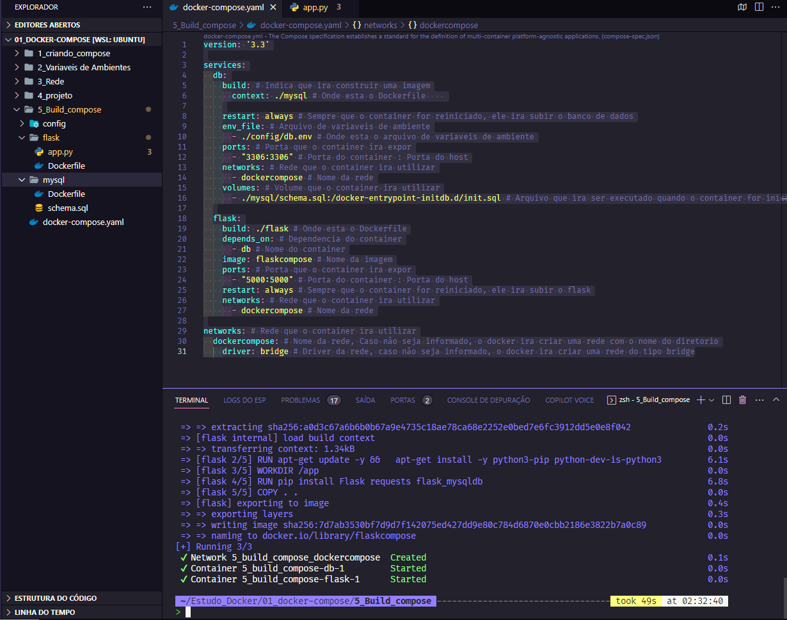
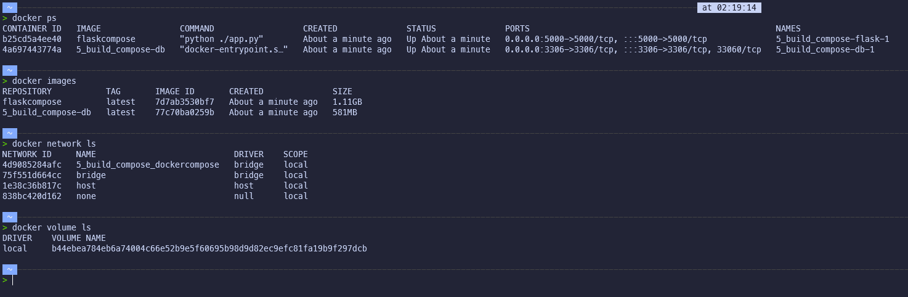
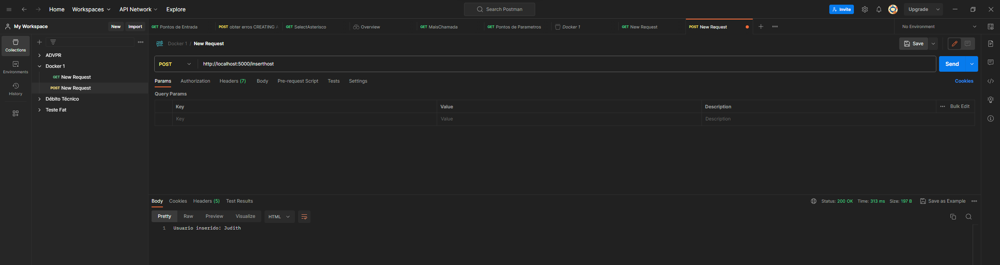

# Realizar o build das imagens no Compose

## Build no Compose

Podemos criar uma imagem Docker a partir de um arquivo `Dockerfile` usando o Compose.

Isso é útil quando queremos criar uma imagem Docker a partir de um arquivo `Dockerfile` e depois executar o container.

Para isso, basta usar o comando `build` no arquivo `docker-compose.yml`, no serviço que queremos criar a imagem.:

```yml

version: '3.3'

services:
  db:
    build: # Indica que ira construir uma imagem
      context: ./mysql # Onde esta o Dockerfile    
    
    restart: always # Sempre que o container for reiniciado, ele ira subir o banco de dados
    env_file: # Arquivo de variaveis de ambiente
      - ./config/db.env # Onde esta o arquivo de variaveis de ambiente
    ports: # Porta que o container ira expor
      - "3306:3306" # Porta do container : Porta do host
    networks: # Rede que o container ira utilizar
      - dockercompose # Nome da rede
    volumes: # Volume que o container ira utilizar
      - ./mysql/schema.sql:/docker-entrypoint-initdb.d/init.sql # Arquivo que ira ser executado quando o container for iniciado
  
  flask:
    build: ./flask # Onde esta o Dockerfile
    depends_on: # Dependencia do container
      - db # Nome do container
    image: flaskcompose # Nome da imagem
    ports: # Porta que o container ira expor
      - "5000:5000" # Porta do container : Porta do host
    restart: always # Sempre que o container for reiniciado, ele ira subir o flask
    networks: # Rede que o container ira utilizar
      - dockercompose # Nome da rede

networks: # Rede que o container ira utilizar
  dockercompose: # Nome da rede, Caso não seja informado, o docker ira criar uma rede com o nome do diretorio
    driver: bridge # Driver da rede, caso não seja informado, o docker ira criar uma rede do tipo bridge

```

Definimos o `build` no serviço `db` e indicamos o contexto (`context`) ou seja, o diretório onde está o `Dockerfile` e o nome do `Dockerfile` (`dockerfile`).

Depois, definimos o `build` no serviço `flask` e indicamos o contexto do `Dockerfile`.

Agora, podemos executar o comando `docker-compose up -d` para criar as imagens e executar os containers.

```bash

docker-compose up -d

```



Podemos verificar se as imagens foram criadas com o comando `docker images`.

```bash

docker images

```

Podemos verificar se os containers estão em execução com o comando `docker ps`.

```bash

docker ps

```



Consumo so serviço


