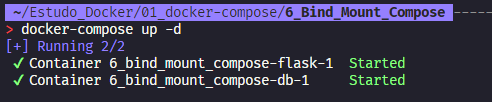

# Volume Bind Mount no compose

O `volume bind mount` é um recurso do `docker` que permite que um diretório do `host` seja montado dentro do container.

O `volume bind mount` é muito utilizado para persistir dados, por exemplo, quando queremos que os dados do banco de dados sejam persistidos mesmo que o container seja removido.

O volume bind mount garante a atualização dos dados em tempo real, ou seja, se um arquivo for alterado no `host`, a alteração será refletida no container e vice-versa.

Podemos utilizar o `volume bind mount` no `docker-compose` para montar um diretório do `host` dentro do container.

Para utilizar o `volume bind mount` no `docker-compose`, devemos definir o `volume` no serviço que irá utilizar o `volume bind mount`.

```yml
version: '3.3'

services:
  db:
    build: # Indica que ira construir uma imagem
      context: ./mysql # Onde esta o Dockerfile    
    
    restart: always # Sempre que o container for reiniciado, ele ira subir o banco de dados
    env_file: # Arquivo de variaveis de ambiente
      - ./config/db.env # Onde esta o arquivo de variaveis de ambiente
    ports: # Porta que o container ira expor
      - "3306:3306" # Porta do container : Porta do host
    networks: # Rede que o container ira utilizar
      - dockercompose # Nome da rede
    volumes: # Volume que o container ira utilizar
      - ./mysql/schema.sql:/docker-entrypoint-initdb.d/init.sql # Arquivo que ira ser executado quando o container for iniciado
  
  flask:
    build: ./flask # Onde esta o Dockerfile
    depends_on: # Dependencia do container
      - db # Nome do container
    image: flaskcompose # Nome da imagem
    ports: # Porta que o container ira expor
      - "5000:5000" # Porta do container : Porta do host
    restart: always # Sempre que o container for reiniciado, ele ira subir o flask
    volumes: # Volume que o container ira utilizar
      - /home/rafael/Estudo_Docker/01_docker-compose/6_Bind_Mount_Compose/flask:/app # Diretorio do host : Diretorio do container
    networks: # Rede que o container ira utilizar
      - dockercompose # Nome da rede

networks: # Rede que o container ira utilizar
  dockercompose: # Nome da rede, Caso não seja informado, o docker ira criar uma rede com o nome do diretorio
    driver: bridge # Driver da rede, caso não seja informado, o docker ira criar uma rede do tipo bridge
```

Foi adicionado a chave `volumes` no serviço `flask` para montar o diretório `/home/rafael/Estudo_Docker/01_docker-compose/6_Bind_Mount_Compose/flask` do `host` dentro do container no diretório `/app`.

Vamos executar o `docker-compose` para subir os serviços.

```bash

docker-compose up -d

```



Agora vamos acessar o container do serviço `flask` e verificar se o diretório foi montado.

```bash

docker exec -it flaskcompose bash

```

Agora vamos verificar se o diretório foi montado.

```bash

root@a37df83dd03e:/app# ls -la

total 16
drwxr-xr-x 2 1000 1000 4096 Sep  8 05:40 .
drwxr-xr-x 1 root root 4096 Sep  8 05:52 ..
-rw-r--r-- 1 1000 1000  207 Sep  8 05:40 Dockerfile
-rw-r--r-- 1 1000 1000 1041 Sep  8 05:56 app.py

root@a37df83dd03e:/app# ls
Dockerfile  app.py

```