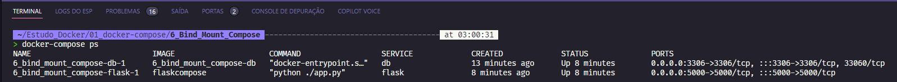

# Monitorando o que tem no compose

Podemos fazer o monitoramento dos serviços que estão rodando no `docker-compose` utilizando o comando `docker-compose ps`.

```bash

docker-compose ps

```

É possível ver o status dos serviços, o nome do container, o diretório onde esta o `docker-compose` e o nome do projeto.



