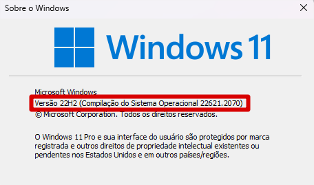

# O que é WSL 2?

O WSL 2 é a segunda geração do Windows Subsystem for Linux (WSL), um ambiente de execução do Linux para o Windows. O WSL 2 é um ambiente de execução separado do WSL 1, que utiliza um kernel Linux com uma máquina virtual leve (VM) para gerenciar os recursos do sistema operacional. O WSL 2 é executado em um ambiente virtualizado, mas fornece um desempenho aprimorado e uma experiência de usuário mais integrada com o Windows.

## Sumario

- [O que é WSL 2?](#o-que-é-wsl-2)
  - [Sumario](#sumario)
  - [Por que usar o WSL 2?](#por-que-usar-o-wsl-2)
  - [Requisitos do sistema](#requisitos-do-sistema)
  - [Instalação do WSL 2](#instalação-do-wsl-2)
    - [Instalando o WSL 2 através do PowerShell](#instalando-o-wsl-2-através-do-powershell)
    - [Instalando o WSL 2 habilitando o recurso no Windows sem instalar a distribuição Linux padrão](#instalando-o-wsl-2-habilitando-o-recurso-no-windows-sem-instalar-a-distribuição-linux-padrão)
      - [Habilitando o subsistema do Windows para Linux (WSL)](#habilitando-o-subsistema-do-windows-para-linux-wsl)
      - [Habilitando o recurso de máquina virtual](#habilitando-o-recurso-de-máquina-virtual)
    - [Instalando e Atualizando o pacote de atualização do kernel do Linux para o WSL2](#instalando-e-atualizando-o-pacote-de-atualização-do-kernel-do-linux-para-o-wsl2)
  - [Definindo o WSL2 como versão padrão](#definindo-o-wsl2-como-versão-padrão)
  - [Instalando a distribuição Linux de sua preferência](#instalando-a-distribuição-linux-de-sua-preferência)
    - [Instalando a distribuição Linux através da Microsoft Store](#instalando-a-distribuição-linux-através-da-microsoft-store)
    - [Instalando a distribuição Linux através do PowerShell](#instalando-a-distribuição-linux-através-do-powershell)
  - [Mover ou importar a instalação do WSL2 para outro local](#mover-ou-importar-a-instalação-do-wsl2-para-outro-local)
    - [Exportando a instalação do WSL2](#exportando-a-instalação-do-wsl2)
    - [Importando a instalação do WSL2](#importando-a-instalação-do-wsl2)
    - [Removendo uma distribuição Linux](#removendo-uma-distribuição-linux)
  - [Configurando recursos do computador para o WSL 2](#configurando-recursos-do-computador-para-o-wsl-2)
    - [Alterando os recursos de uma distribuição Linux no WSL 2 através do PowerShell](#alterando-os-recursos-de-uma-distribuição-linux-no-wsl-2-através-do-powershell)
    - [Alterando os recursos de uma distribuição Linux no WSL 2 através do arquivo .wslconfig](#alterando-os-recursos-de-uma-distribuição-linux-no-wsl-2-através-do-arquivo-wslconfig)
  - [Comandos básicos do WSL](#comandos-básicos-do-wsl)
  - [Dicas de desempenho e boas práticas](#dicas-de-desempenho-e-boas-práticas)
  - [Links para guia de instalação](#links-para-guia-de-instalação)

## Por que usar o WSL 2?

O WSL 2 é uma nova versão do WSL e é uma atualização automática. Como o WSL 2 é um ambiente de execução separado, você pode ter as duas versões `(WSL 1 e WSL 2)` no mesmo dispositivo e escolher qual usar por padrão. O WSL 2 é recomendado se você estiver executando um aplicativo que requer um kernel Linux completo e/ou se você estiver executando um aplicativo que interage com o hardware, a rede ou o sistema de arquivos, como Docker ou o FUSE.

As principais melhorias do WSL 2 são:

- Desempenho aprimorado: o desempenho do sistema de arquivos do WSL 2 é muito maior do que o do WSL 1. Isso significa que a leitura e gravação de arquivos será muito mais rápida e que você poderá executar aplicativos que exigem acesso ao sistema de arquivos com mais rapidez.
- Compatibilidade total do sistema de chamadas: o WSL 2 oferece uma compatibilidade completa do sistema de chamadas, o que permite executar mais aplicativos Linux no WSL 2, como Docker, NodeJS, etc.
- Suporte a aplicativos com várias plataformas: o WSL 2 oferece suporte a aplicativos com várias plataformas, como Docker, que podem ser executados no WSL 2 e acessar o sistema de arquivos do Windows.
- Melhor integração com o Windows: o WSL 2 oferece uma melhor integração com o Windows. Por exemplo, você pode executar comandos do WSL no Prompt de Comando ou no PowerShell e vice-versa. Além disso, você pode abrir arquivos do Windows no Linux usando o WSL.

[Compare as versões do WSL](https://docs.microsoft.com/pt-br/windows/wsl/compare-versions)

## Requisitos do sistema

Para usar o WSL 2, você precisa atender aos seguintes requisitos:

- Windows 10

  - Versão 2004 ou posterior (Build 19041 ou posterior)
  - Para versões anteriores do Windows 10, consulte [Instalação manual do WSL](https://docs.microsoft.com/pt-br/windows/wsl/install-manual).
  - Caso utilizando Windows 10 é necessário atualizar para a versão 2004 ou posterior (Build 19041 ou posterior).

  - Abaixo estão os links para download da atualização do Windows 10 2022 (versão 22H2):

  - [Atualização do Windows 10 2022 l versão 22H2](https://www.microsoft.com/pt-br/software-download/windows10)

- Windows 11

  - Versão 21H2 ou posterior (Build 22000 ou posterior)

- Um sistema operacional de 64 bits
- Uma CPU com suporte a virtualização habilitada na BIOS
- Pelo menos 4 GB de RAM
- Pelo menos 64 GB de armazenamento disponível

Para verificar a versão do Windows, execute o comando abaixo no PowerShell ou no executar do Windows:

```powershell

winver

```

Será exibida uma janela com a versão do Windows instalada.

Exemplo:



## Instalação do WSL 2

Verifique se seu Windows está atualizado, pois o WSL 2 depende de uma versão atualizada do Hyper-V. Verifique o Windows Update.

### Instalando o WSL 2 através do PowerShell

- Abra o PowerShell como administrador e execute o comando abaixo:

```powershell

wsl --install

```

- Este comando habilitara os recurso necessários para executar o WSL e instala a distribuição Linux padrão (Ubuntu).

Fonte: [Comando de instalação do WSL](https://learn.microsoft.com/pt-br/windows/wsl/install#install-wsl-command)

### Instalando o WSL 2 habilitando o recurso no Windows sem instalar a distribuição Linux padrão

Este método é recomendado para usuários que desejam instalar manualmente uma distribuição Linux diferente da padrão (Ubuntu).

#### Habilitando o subsistema do Windows para Linux (WSL)

Abra o PowerShell como administrador e execute o comando abaixo:

```powershell

dism.exe /online /enable-feature /featurename:Microsoft-Windows-Subsystem-Linux /all /norestart

```

- Este comando habilita o recurso do WSL no Windows.
  - Detalhes do comando:
    - `dism.exe`: ferramenta de gerenciamento e manutenção de imagens de implantação do Windows.
    - `/online`: indica que o recurso será habilitado no sistema operacional atual.
    - `/enable-feature`: habilita o recurso.
    - `/featurename`: indica o nome do recurso que será habilitado.
    - `/all`: habilita todas as distribuições Linux disponíveis.
    - `/norestart`: evita que o computador seja reiniciado.

#### Habilitando o recurso de máquina virtual

Antes de instalar o WSL 2, você precisa habilitar o recurso de máquina virtual no Windows. Seu computador exigi um processador com suporte a virtualização para executar este recurso.

- Para habilitar o recurso de máquina virtual, execute o comando abaixo:

```powershell

dism.exe /online /enable-feature /featurename:VirtualMachinePlatform /all /norestart

```

- Este comando habilita o recurso de máquina virtual no Windows.

  - Detalhes do comando:
    - `dism.exe`: ferramenta de gerenciamento e manutenção de imagens de implantação do Windows.
    - `/online`: indica que o recurso será habilitado no sistema operacional atual.
    - `/enable-feature`: habilita o recurso.
    - `/featurename`: indica o nome do recurso que será habilitado.
    - `/all`: habilita todas as distribuições Linux disponíveis.
    - `/norestart`: evita que o computador seja reiniciado.

- Reinicie o computador.

### Instalando e Atualizando o pacote de atualização do kernel do Linux para o WSL2

- Baixe e instale o pacote de atualização do kernel do Linux para o WSL2:

Fonte: [Etapas de instalação manual para versões mais antigas do WSL](https://learn.microsoft.com/pt-br/windows/wsl/install-manual)

Para executar o WSL da microsoft Store com atualizações frequentes use os comandos:

```powershell

wsl --install

```

```powershell

wsl --update

```

## Definindo o WSL2 como versão padrão

- Defina o WSL2 como versão padrão:

```powershell

wsl --set-default-version 2

```

## Instalando a distribuição Linux de sua preferência

### Instalando a distribuição Linux através da Microsoft Store

- Abra a Microsoft Store e instale a distribuição Linux de sua preferência.
- Após a instalação, abra a distribuição Linux e siga as instruções para configurar o usuário e senha.
- Após a configuração, a distribuição Linux estará pronta para uso.

Microsoft Store


Na página da distribuição, selecione "Obter"


### Instalando a distribuição Linux através do PowerShell

Também é possível instalar a distribuição Linux através do PowerShell, para isso, execute o comando abaixo:

```powershell

wsl --list --online

```

Atalho do comando: `wsl -l -o`

Este comando lista todas as distribuições Linux disponíveis para instalação.

Para instalar uma distribuição Linux, execute o comando abaixo:

```powershell

wsl --install -d <distribuição>

```

- A flag `-d` é opcional, com ela é possível renomear a distribuição Linux durante a instalação.

Exemplo:

```powershell

wsl --install -d Ubuntu

```

Sugerimos o Ubuntu (sem versão) por ser uma distribuição popular e que já vem com várias ferramentas úteis para desenvolvimento instaladas por padrão.

## Mover ou importar a instalação do WSL2 para outro local

É possível mover ou importar a instalação do WSL2 para outro local, para isso, siga os passos abaixo:

### Exportando a instalação do WSL2

1. Abra o PowerShell como administrador e execute o comando abaixo:

```powershell

wsl --list --verbose

```

2. Execute o comando abaixo para desligar o WSL2:

```powershell

wsl --shutdown

```

3. Execute o comando abaixo para exportar a instalação do WSL2 para um arquivo tar:

```powershell

wsl --export <distro_name> <file_name>

```

- Exemplo:

```powershell

wsl --export Ubuntu-20.04 ubuntu.tar

```

- No exemplo acima, o arquivo `ubuntu.tar` será criado no diretório atual.
- Caso deseje criar o arquivo em outro diretório, informe o caminho completo do arquivo.

  - Exemplo:

  ```powershell

  wsl --export Ubuntu-20.04 C:\Users\user\Documents\ubuntu.tar

  ```

  - Também é possível exportar a instalação do WSL2 para um arquivo tar compactado.

  ```powershell

  wsl --export Ubuntu-20.04 ubuntu.tar.gz

  ```

  Esta extensão é utilizada para criar arquivos compactados.

  - Ou utilizando a extensão vhd.

  ```powershell

  wsl --export Ubuntu-20.04 ubuntu.vhd

  ```

  Esta extensão é utilizada para criar discos virtuais.

### Importando a instalação do WSL2

1. Execute o comando abaixo para importar a instalação do WSL2 a partir de um arquivo tar:

```powershell

wsl --import <distro_name> <install_location> <file_name>

```

- Exemplo:

  ```powershell

  wsl --import ubuntu C:\Users\user\Documents\ubuntu.tar

  ```

  ````
  - Para arquivos com extensão .tar.gz, utilize o comando abaixo:

  ```powershell

  wsl --import Ubuntu C:\Users\user\Documents\ubuntu.tar.gz

  ````

  - Para arquivos com extensão .vhd, utilize o comando abaixo:

    ```powershell

    ```

  wsl --export Ubuntu-20.04 D:\Backups\ubuntu.tar

  ```

  ```

2. Execute o comando abaixo para iniciar o WSL2:

```powershell

wsl

```

3. Execute o comando abaixo para verificar se o WSL2 foi iniciado:

```powershell

wsl --list --verbose

```

### Removendo uma distribuição Linux

Para remover uma distribuição Linux, execute o comando abaixo:

```powershell

wsl --unregister <distro_name>

```

- Exemplo:

```powershell

wsl --unregister Ubuntu-20.04

```

- Este comando remove a distribuição Linux do WSL2, mas não remove os arquivos da distribuição Linux do disco rígido.
- Para remover os arquivos da distribuição Linux do disco rígido, execute o comando abaixo:

```powershell

wsl --unregister <distro_name> --delete

```

Este comando remove a distribuição Linux do WSL2 e os arquivos da distribuição Linux do disco rígido.

Para localizar os arquivos da distribuição Linux no disco rígido, execute o comando abaixo:

```powershell

wsl --list --verbose

```

- Este comando lista todas as distribuições Linux instaladas no WSL2 e seus respectivos diretórios.

- Para remover os arquivos da distribuição Linux do disco rígido, execute o comando abaixo:

```powershell

rm -rf <distro_dir>

```

- Exemplo:

```powershell

rm -rf C:\Users\user\AppData\Local\Packages\CanonicalGroupLimited.Ubuntu20.04onWindows_79rhkp1fndgsc

```

- Este comando remove os arquivos da distribuição Linux do disco rígido.

## Configurando recursos do computador para o WSL 2

O WSL 2 tem acesso quase que total ao recursos de sua máquina. Ele tem acesso por padrão:

- A todo disco rígido.
- A usar completamente os recursos de processamento.
- A usar 80% da memória RAM disponível.
- A usar 25% da memória disponível para SWAP.

Podemos alterar esses valores para que o WSL 2 não use todos os recursos de sua máquina.

### Alterando os recursos de uma distribuição Linux no WSL 2 através do PowerShell

Para isso, abra o PowerShell como administrador e execute o comando abaixo:

```powershell

wsl --list --verbose

```

Este comando lista todas as distribuições Linux instaladas no WSL 2.

Para alterar os recursos de uma distribuição Linux, execute o comando abaixo:

```powershell

wsl --set-default-resource <distro_name> <parameter> <value>

```

- `<distro_name>`: nome da distribuição Linux.
- `<parameter>`: parâmetro que será alterado.
  - `--cpu`: altera o uso de processamento.
  - `--memory`: altera o uso de memória RAM.
  - `--swap`: altera o uso de memória SWAP.

Exemplo:

```powershell

wsl --set-default-resource Ubuntu --cpu 50

```

- No exemplo acima, o uso de processamento da distribuição Ubuntu foi alterado para 50%.

### Alterando os recursos de uma distribuição Linux no WSL 2 através do arquivo .wslconfig

Para alterar os recursos de uma distribuição Linux, execute o comando abaixo:

```powershell

notepad $env:USERPROFILE/.wslconfig

```

substitua o `notepad` pelo editor de sua preferência.
Substitua o `USERPROFILE` pelo nome do usuário do Windows.

Exemplo:

```powershell

code $env:rafael/.wslconfig

```

- Este comando abre o arquivo .wslconfig no bloco de notas.
- Caso o arquivo não exista, ele será criado.
- Caso o arquivo exista, ele será aberto no bloco de notas.

Ou crie arquivo .wslconfig no diretório do usuário do Windows e adicione as configurações abaixo:

```powershell

[wsl2]

memory=4GB # Limits VM memory in WSL 2 to 4 GB

processors=2 # Makes the WSL 2 VM use two virtual processors

swap=8GB # Sets the size of the swap file in WSL 2 to 8 GB

localhostForwarding=true # Forward localhost to WSL 2

# Enable experimental features
[experimental]
sparseVhd=true # Enable sparse VHD support - Ativa a compactação de disco virtual para economizar espaço em disco.

autoMemoryReclaim=gradual ou dropche: # Habilita a reivindicação automática de memória, libera memoria RAM não utilizada. Não usar quando for usar o WSL2 com Docker.

```

- `memory`: define o limite de memória RAM que o WSL 2 pode usar.
- `processors`: define o número de processadores que o WSL 2 pode usar.
- `swap`: define o tamanho do arquivo de troca (SWAP) que o WSL 2 pode usar.
- `localhostForwarding`: define se o WSL 2 pode acessar o localhost do Windows.
- `true`: habilita o acesso ao localhost do Windows.
- `false`: desabilita o acesso ao localhost do Windows.
- `localhost`: define o endereço IP do localhost do Windows.
- `autoMemoryReclaim`: habilita a reivindicação automática de memória, libera memoria RAM não utilizada.

Exemplo:

```powershell

[wsl2]

memory=4GB # Limits VM memory in WSL 2 to 4 GB

processors=2 # Makes the WSL 2 VM use two virtual processors

swap=8GB # Sets the size of the swap file in WSL 2 to 8 GB

localhostForwarding=true # Forward localhost to WSL 2

localhost=

```

Após alterar o arquivo .wslconfig, salve-o e reinicie o WSL 2.

Para reiniciar o WSL 2, execute o comando abaixo:

```powershell

wsl --shutdown

```

Este comando desliga as distribuições Linux em execução no WSL 2.

Para iniciar o WSL 2, execute o comando abaixo:

```powershell

wsl

```

Este comando inicia o WSL 2.

Outras configurações podem ser adicionadas ao arquivo .wslconfig, acessando o link abaixo:

[Configurações do arquivo .wslconfig](https://learn.microsoft.com/pt-br/windows/wsl/wsl-config#main-wsl-settings)

````powershell

[wsl2]

## Primeiros passos após instalar o WSL 2

1. **Crie seu usuário e senha:**
   Ao abrir a distribuição pela primeira vez, será solicitado criar um usuário e senha para o ambiente Linux.

2. **Atualize o sistema e os pacotes:**
   Para distribuições baseadas em Debian/Ubuntu, execute:

   ```bash
   sudo apt update && sudo apt upgrade -y
````

Para outras distribuições, utilize o gerenciador de pacotes correspondente (ex: `dnf`, `zypper`, `apk`).

3. **Comandos úteis iniciais:**
   - Verificar versão do kernel: `uname -r`
   - Verificar espaço em disco: `df -h`
   - Verificar informações do sistema: `lsb_release -a` (Debian/Ubuntu)

## Comandos básicos do WSL

- Listar distribuições instaladas:
  ```powershell
  wsl --list --verbose
  ```
- Listar distribuições disponíveis para instalação:
  ```powershell
  wsl --list --online
  ```
- Definir distribuição padrão:
  ```powershell
  wsl --set-default <NomeDaDistribuicao>
  ```
- Atualizar o WSL e kernel:
  ```powershell
  wsl --update
  ```
- Desligar todas as distribuições:
  ```powershell
  wsl --shutdown
  ```
- Exportar uma distribuição:
  ```powershell
  wsl --export <distro_name> <arquivo.tar>
  ```
- Importar uma distribuição:
  ```powershell
  wsl --import <distro_name> <caminho> <arquivo.tar>
  ```
- Remover uma distribuição:
  ```powershell
  wsl --unregister <distro_name>
  ```

## Dicas de desempenho e boas práticas

- **Armazene seus projetos em:**  
  `\\wsl$\NomeDaDistro\home\SeuUsuario\Projetos`  
  Isso garante melhor desempenho de I/O do que usar pastas do Windows.

- **Acesse arquivos do Windows pelo Linux:**  
  O caminho `/mnt/c/Users/SeuUsuario` permite acessar arquivos do Windows dentro do WSL.

- **Abra o explorador de arquivos do Windows no diretório atual do Linux:**

  ```bash
  explorer.exe .
  ```

- **Sempre mantenha o WSL e o kernel atualizados:**  
  Use `wsl --update` regularmente.

- **Verifique se a virtualização está habilitada:**  
  No Gerenciador de Tarefas > Desempenho > CPU, veja se "Virtualização" está como "Habilitado".

## Links para guia de instalação

- [Instalando o WSL](https://learn.microsoft.com/pt-br/windows/wsl/install)
- [Instalação Manual do WSL](https://learn.microsoft.com/pt-br/windows/wsl/install-manual)
- [WSL e Docker](https://github.com/codeedu/wsl2-docker-quickstart)
- [WSL - Windows Subsystem for Linux](https://youtu.be/-oxnRGhA9Mg?si=sDKEN_sxXT4_m226)
- [Como montar o melhor ambiente Dev no Windows, Linux e Mac com WSL2
  ](https://www.youtube.com/live/rpvjVtUPnOc?si=9yxSTRuPvR33ccXQ)
- [Documentação oficial do WSL (Microsoft)](https://learn.microsoft.com/pt-br/windows/wsl/)
- [Comandos básicos do WSL 2 no Windows 11 (MundoBytes)](https://mundobytes.com/pt/Comandos-b%C3%A1sicos-do-WSL-2-no-Windows-11/)
- [WSL e Docker](https://github.com/codeedu/wsl2-docker-quickstart)
- [WSL - Windows Subsystem for Linux](https://youtu.be/-oxnRGhA9Mg?si=sDKEN_sxXT4_m226)
- [Como montar o melhor ambiente Dev no Windows, Linux e Mac com WSL2
  ](https://www.youtube.com/live/rpvjVtUPnOc?si=9yxSTRuPvR33ccXQ)

```

```
