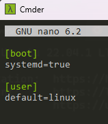

Sumario
---

- [Instalação e configuração do Ubuntu](#instalação-e-configuração-do-ubuntu)
  - [Instalação do Ubuntu](#instalação-do-ubuntu)
  - [Configuração do Ubuntu](#configuração-do-ubuntu)
    - [Configuração do usuário](#configuração-do-usuário)
  - [Atualizando o Ubuntu](#atualizando-o-ubuntu)
  - [Definindo systemd como gerenciador de serviços](#definindo-systemd-como-gerenciador-de-serviços)
- [Referências](#referências)


# Instalação e configuração do Ubuntu

Apos a instalação do WSL, vamos instalar o Ubuntu.

## Instalação do Ubuntu

1. Execute o comando abaixo para verificar se o Ubuntu já está instalado:

```powershell

wsl --list --verbose

```

2. Caso não possua a distribuição ubuntu execute o comando abaixo para instalar o Ubuntu:

```powershell

wsl --install -d Ubuntu

```
3. Execute o comando abaixo para verificar se o Ubuntu foi instalado:

```powershell

wsl --list --verbose

```

4. Execute o comando abaixo para iniciar o Ubuntu:

```powershell

wsl -d Ubuntu

```

## Configuração do Ubuntu

### Configuração do usuário

Após o término do comando, você deverá criar um nome de usuário que poderá ser o mesmo da sua máquina e uma senha, este será o usuário root da sua instância WSL.


## Atualizando o Ubuntu

1. Execute o comando abaixo para verificar a versão do Ubuntu:   

```bash

lsb_release -a

```

2. Execute o comando abaixo para atualizar o Ubuntu:

```bash

sudo apt update && sudo apt upgrade -y

```

Explicando o comando acima:

- `sudo`: Executa o comando como administrador.
- `apt`: Gerenciador de pacotes do Ubuntu.
- `update`: Atualiza a lista de pacotes disponíveis.
- `&&`: Executa o próximo comando se o comando anterior for executado com sucesso.
- `upgrade`: Atualiza os pacotes instalados.
- `-y`: Confirma todas as perguntas feitas durante a atualização.


## Definindo systemd como gerenciador de serviços

Utilizar o systemd como gerenciador de serviços é uma boa prática, pois ele é o gerenciador de serviços padrão do Ubuntu.

Para definir que o systemd será o gerenciador de serviços do Ubuntu, execute os comandos:

- `sudo nano /etc/wsl.conf`: Abre o arquivo wsl.conf para edição.
- Verifique se o arquivo possui o conteúdo abaixo:
  - [Boot]
  - systemd=true

  - Caso queira que WSL inicialize com algum usuário específico, adicione a linha abaixo:
    - [User]
    - Default=<user_name>
    - Substitua `<user_name>` pelo nome do usuário que deseja que o WSL inicie.


- Caso o arquivo não possua o conteúdo acima, adicione-o ao arquivo e salve as alterações.
- Para salvar as alterações, pressione as teclas `Ctrl + X` e depois pressione a tecla `Y` para confirmar a gravação das alterações.

- Reinicie o Ubuntu para aplicar as alterações.

```bash	
sudo reboot
```


 


- Execute o comando `systemctl list-units-files` para verificar se o systemd está instalado:

```bash

systemctl list-unit-files

```

Explicando o comando acima:

- `systemctl`: Comando para gerenciar serviços.
- `list-unit-files`: Lista os serviços instalados.

Outros exemplos de comandos:
- `list-unit-files --type=service`: Lista os serviços instalados.
- `list-unit-files --type=service --state=enabled`: Lista os serviços instalados e habilitados.
- `list-unit-files --type=service --state=disabled`: Lista os serviços instalados e desabilitados.
- `list-unit-files --type=service --state=masked`: Lista os serviços instalados e mascarados. 


# Referências
[O Guia DEFINITIVO de UBUNTU para Devs Iniciantes](https://www.youtube.com/watch?v=CouuH3W6ZtA)
[O Melhor Setup Dev com Arch e WSL2](https://www.youtube.com/watch?v=sjrW74Hx5Po&t=989s)
[Windows Subsystem for Linux setup WSL2 Systemd, Ansible, and Kubernetes](https://www.youtube.com/watch?v=CouuH3W6ZtA)