# Configurando SSH no WSL

Índice:

- [Configurando SSH no WSL](#configurando-ssh-no-wsl)
  - [Configurações iniciais](#configurações-iniciais)
    - [Pré-Requisitos](#pré-requisitos)
    - [Utilizando o sshd](#utilizando-o-sshd)
    - [Inicializando a Distro WSL na inicialização do Windows](#inicializando-a-distro-wsl-na-inicialização-do-windows)
    - [Pegando o IP da sessão da distro WSL no Windows](#pegando-o-ip-da-sessão-da-distro-wsl-no-windows)
    - [Deletando a regra de proxy de porta de rede existente e criando uma nova](#deletando-a-regra-de-proxy-de-porta-de-rede-existente-e-criando-uma-nova)
      - [A informação a seguir foi providenciada por Scott Hanselman no seu blog 'How to SSH into WSL2 on Windows 10 from an external machine'](#a-informação-a-seguir-foi-providenciada-por-scott-hanselman-no-seu-blog-how-to-ssh-into-wsl2-on-windows-10-from-an-external-machine)
    - [Liberando a porta 22 no Firewall do Windows Defender](#liberando-a-porta-22-no-firewall-do-windows-defender)
    - [Automatizando o script usando Agendador de Tarefas do Windows](#automatizando-o-script-usando-agendador-de-tarefas-do-windows)
    - [Acessando o SSH de um computador remoto](#acessando-o-ssh-de-um-computador-remoto)
    - [Fontes:](#fontes)

## Configurações iniciais

### Pré-Requisitos

- Para poder criar um usuário e dar a ele acesso de sudo, será necessário conectar no terminal do seu WSL via SSH. Para isso, execute os comandos abaixo para instalar o OpenSSH Server:

```bash
sudo apt update
sudo apt install openssh-server
```

- Confirme que a instalação deu certo executando o comando abaixo:

```bash
sudo service ssh status
```

- O retorno deverá ser semelhante ao abaixo:
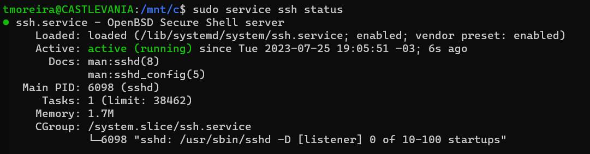

- Se o serviço não estiver ativo, execute o comando abaixo para ativar:

```bash
sudo systemctl start sshd.service
```


### Utilizando o sshd
- Vamos checar se o sshd está funcionando como deveria. Para isto, execute o comando abaixo, lembrando que o usuário 'tmoreira' deve ser alterado para o usuário que você criou no momento da instalação do WSL2:

```bash
ssh tmoreira@localhost
```

- Será apresentado um retorno conforme abaixo no console. Digite 'yes' e tecle enter para confirmar a conexão:
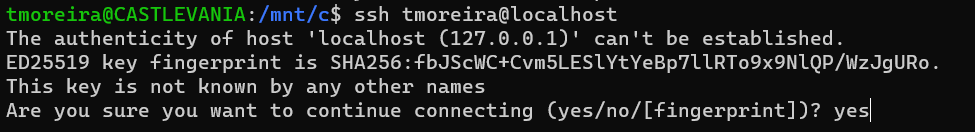

- Digite a sua senha quando solicitado. Isto irá conectá-lo à mesma sessão WSL, porém, via SSH.
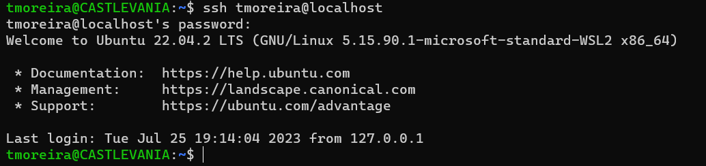

- Verifique se o sshd está funcionando corretamente a partir da máquina host (no nosso caso, Windows). Para isso, execute o comando abaixo:
```bash
ipconfig
```

- Este comando deverá retornar o ip da sua sessão da distro WSL (no nosso caso, Ubuntu-22.04), sendo o IP do exemplo '172.22.236.87':
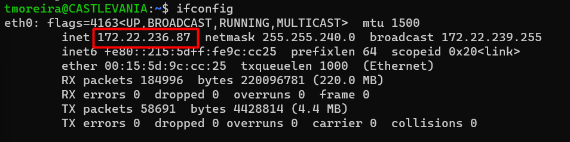


- Através do seu terminal Windows, conecte à distro WSL usando seu endereço de IP via SSH:

```bash
ssh tmoreira@172.22.236.87
```

- Digite 'yes' e em seguida a sua senha. O retorno deverá ser conforme abaixo:
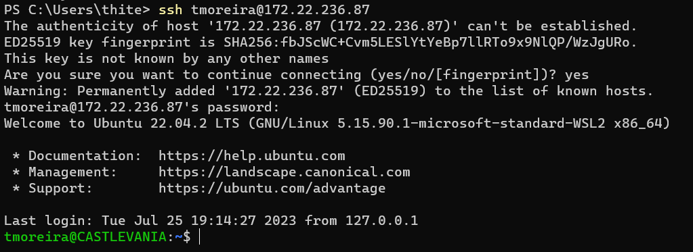


### Inicializando a Distro WSL na inicialização do Windows

- Abra o PowerShell e clique na opção Configurações:
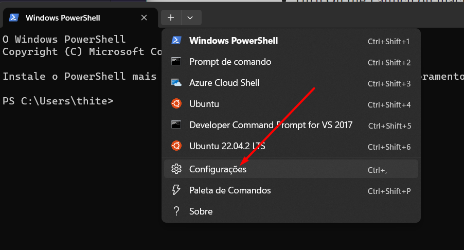

- Marque as opções conforme imagem abaixo e clique em Salvar:
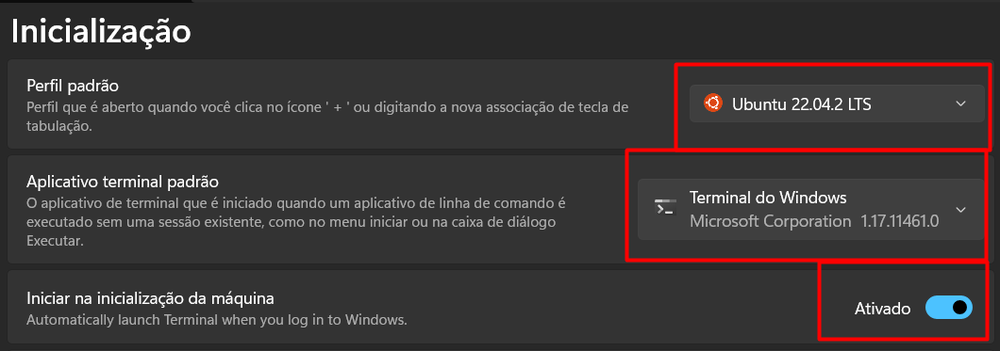

- Com essas configurações, toda vez que o Windows inicializar, a distro WSL também será inicializada.

### Pegando o IP da sessão da distro WSL no Windows

- Abra o PowerShell e execute o comando abaixo para pegar o IP da sessão da distro WSL:

```bash
wsl -d "Ubuntu-22.04" hostname -I
```
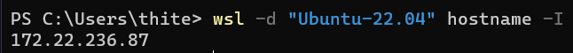

- Em alguns casos, serão retornados dois IP's.No nosso caso, retornou apenas o IP '172.22.236.87'. Devemos então armazenar o ip em 2 variáveis, conforme abaixo:

```bash
$wsl_ipaddress = wsl -d "Ubuntu-22.04" hostname -I
$wsl_ipaddress1 = $wsl_ipaddress.split(" ", 2)[0]
```


- Para testar se a variável foi armazenada corretamente, execute os comandos abaixos:

```bash
$wsl_ipaddress
$wsl_ipaddress1
```
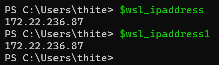

### Deletando a regra de proxy de porta de rede existente e criando uma nova

#### A informação a seguir foi providenciada por Scott Hanselman no seu blog '[How to SSH into WSL2 on Windows 10 from an external machine](https://www.hanselman.com/blog/how-to-access-localhost-while-running-wsl2-windows-subsystem-for-linux)'

- Abra o PowerShell como administrador e execute o comando abaixo para deletar/adicionar regras de proxy de porta de rede existente:


```bash
$ netsh interface portproxy delete v4tov4 listenaddress=0.0.0.0 listenport=22
$ netsh interface portproxy add v4tov4 listenaddress=0.0.0.0 listenport=22 connectaddress=$wsl_ipaddress1 connectport=22
```
Nota: o primeiro comando deleta a regra de proxy de porta de rede existente e o segundo comando cria uma nova regra de proxy de porta de rede. Portanto, caso o retorno do primeiro comando seja 'O sistema não pode encontrar o arquivo especificado.', não se preocupe, pois isso significa que não existe nenhuma regra de proxy de porta de rede existente.

- Para testar se a regra de proxy de porta de rede foi criada corretamente, execute o comando abaixo:

```bash
netsh interface portproxy show v4tov4
```

- Caso o retorno seja conforme abaixo, significa que a regra de proxy de porta de rede foi criada com sucesso:
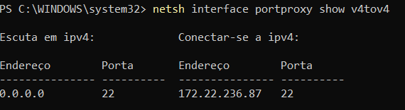

### Liberando a porta 22 no Firewall do Windows Defender
- Por padrão, a porta 22 é bloqueada pelo firewall do Windows. Para liberar a porta 22, execute o comando abaixo:

```bash
netsh advfirewall firewall add rule name=WSLSSH dir=in action=allow protocol=TCP localport=22
```

### Automatizando o script usando Agendador de Tarefas do Windows

- Use um bloco de notas para criar um novo arquivo de texto contendo os comandos abaixo:

```bash
$wsl_ipaddress = wsl -d "Ubuntu" hostname -I
$wsl_ipaddress1 = $wsl_ipaddress.split(" ", 2)[0]
netsh interface portproxy delete v4tov4 listenaddress=0.0.0.0 listenport=22
netsh interface portproxy add v4tov4 listenaddress=0.0.0.0 listenport=22 connectaddress=$wsl_ipaddress1 connectport=22
```

- Salve o arquivo com o nome 'wsl_ssh.ps1' em alguma pasta

- Abra o Agendador de Tarefas do Windows e clique em 'Criar Tarefa':
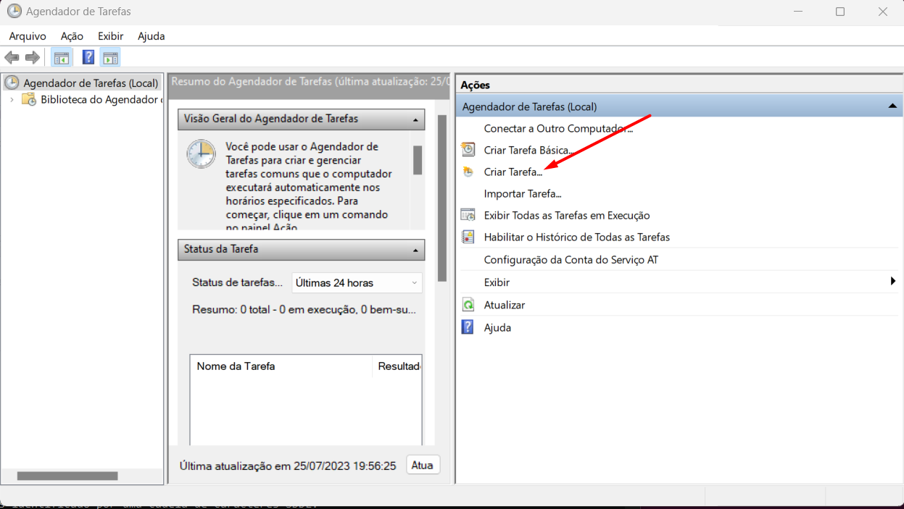

- Na aba 'Geral', preencha o campo Nome com o nome que desejar, selecione 'Executar somente quando o usuário estiver conectado' e marque a opção 'Executar com privilégios mais altos':
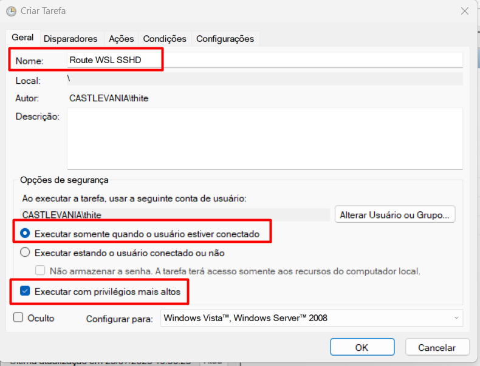

- Na aba Disparadores, clique em 'Novo' e selecione a opção 'Ao inicializar', 'Atrasar a tarefa em' e preencha o campo com o tempo que desejar. No nosso caso, colocamos 1 minuto e selecione 'Habilitado':
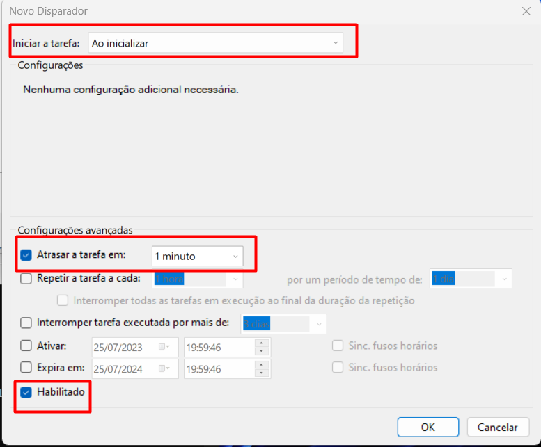

- na Aba Ações clique em 'Novo' e selecione a opção 'Iniciar um programa'. No campo 'Programa/script', selecione o caminho do PowerShell.exe. No campo 'Adicione argumentos (opcional)', digite o caminho do arquivo 'wsl_ssh.ps1' que você criou no bloco de notas conforme abaixo:

```bash
-ExecutionPolicy Bypass -File C:\Users\thite\Documents\git\totvs\schedule\wsl_ssh.ps1
```

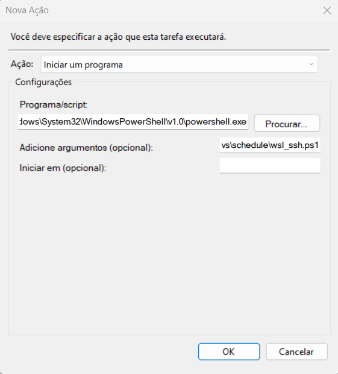

### Acessando o SSH de um computador remoto

- Para acessar o SSH de um computador remoto, execute o comando abaixo no terminal do computador remoto:

```bash
ssh tmoreira@192.168.1.100
```
Nota: substitua 'tmoreira' e ip '192.168.1.100' de acordo com as suas configurações.

- Digite 'yes' e em seguida a sua senha. O retorno deverá ser conforme abaixo:


- Se a sua sessão estiver dando timeout, execute o comando abaixo para testar a conectividade da rede através da porta, substituindo para o seu ip da máquina remota:

```bash
Test-NetConnection -ComputerName 192.168.1.100 -Port 22
```

- Caso retorne TcpTestSuceeded = True, significa que a porta está aberta e a sessão SSH deverá funcionar normalmente, não se tratando de um problema de firewall. Se o retorno for TcpTestSuceeded = False, significa que a porta está fechada e você deverá abrir a porta 22 no firewall da máquina remota. Use o comando abaixo para tal:

```bash
netsh advfirewall firewall add rule name="WSL SSH" dir=in action=allow protocol=TCP localport=22
```

- Cheque se a nova regra foi adicionada com sucesso ao firewall:

```bash
Get-NetFirewallPortFilter | Where-Object { $_.LocalPort -eq 22 } | Get-NetFirewallRule
```

- Se as regras do firewall estiverem corretas, entretanto sua sessão SSH continua a dar time out, talvez seja necessário resetar as regras de proxy uma vez que pode existir mais de uma regra em conflito:

```bash
netsh int portproxy reset all
```

### Fontes:
-[Enable SSH access into WSL from a remote computer](https://medium.com/geekculture/enable-ssh-access-into-wsl-from-a-remote-computer-f2e4a962430)

- [Netsh Advanced control - firewall behavior](https://learn.microsoft.com/en-us/troubleshoot/windows-server/networking/netsh-advfirewall-firewall-control-firewall-behavior)

- [How to SSH into WSL2 on Windows 10 from an external machine — Scott Hanselman’s Blog](https://www.hanselman.com/blog/how-to-ssh-into-wsl2-on-windows-10-from-an-external-machine)

- [Release Notes for WSL in the Microsoft Store | Microsoft Learn](https://learn.microsoft.com/en-us/windows/wsl/store-release-notes#known-issues)

- [Setup SSH Server on Windows 11](https://medium.com/geekculture/setup-ssh-server-on-windows-10-11-34c7f096eaff)

