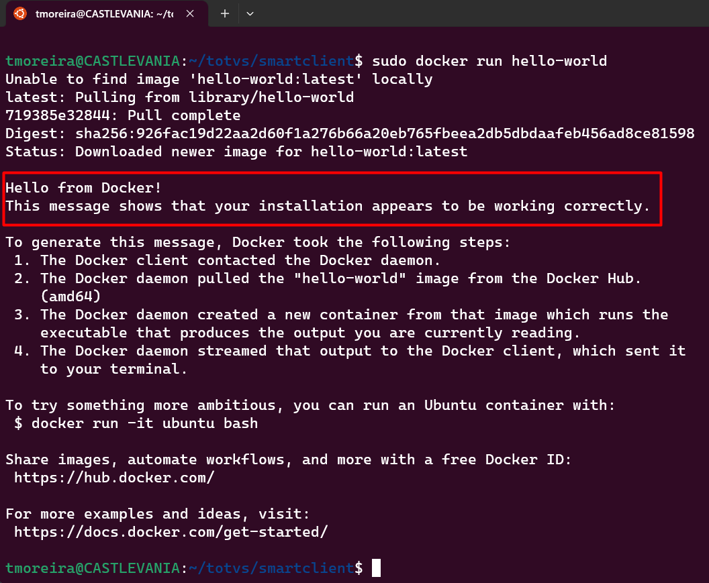

# Instalando Docker no Ubuntu

## Índice

- [Instalando Docker no Ubuntu](#instalando-docker-no-ubuntu)
  - [Índice](#índice)
  - [Pré-Requisitos](#pré-requisitos)
  - [Instalando o Docker Engine](#instalando-o-docker-engine)
    - [1) Latest Version](#1-latest-version)
    - [ou 2) Specific Version](#ou-2-specific-version)

## Pré-Requisitos

Antes de tudo, atualize sua lista existente de pacotes:

```bash
sudo apt update
```

Em seguida, desinstale possíveis versões antigas do Docker e pacotes conflitantes:

```bash
for pkg in docker.io docker-doc docker-compose podman-docker containerd runc; do sudo apt-get remove $pkg; done
```

Conforme o [manual do docker](https://docs.docker.com/engine/install/ubuntu/), existem 4 possíveis formas de instalação do Docker no Linux:
- O Docker Engine vem incluído no [Docker Desktop](https://docs.docker.com/desktop/install/linux-install/) para Linux. Esta é a maneira mais fácil e rápida de começar.

- Configurar e instalar o Docker Engine a partir do repositório "apt" do Docker. **<-- VAMOS UTILIZAR ESSA**

- Instalá-lo manualmente e gerenciar as atualizações manualmente.

- Utilizar um script de conveniência. Recomendado apenas para ambientes de teste e desenvolvimento.

Execute o comando abaixo para instalar os pacotes que permitem ao apt utilizar um repositório via HTTPS:
    
```bash
sudo apt-get install ca-certificates curl gnupg
```

Adicione a chave GPG oficial do Docker:

```bash
sudo install -m 0755 -d /etc/apt/keyrings

curl -fsSL https://download.docker.com/linux/ubuntu/gpg | sudo gpg --dearmor -o /etc/apt/keyrings/docker.gpg

sudo chmod a+r /etc/apt/keyrings/docker.gpg
```

Execute o seguinte comando para configurar o repositório:

```bash
echo \
  "deb [arch="$(dpkg --print-architecture)" signed-by=/etc/apt/keyrings/docker.gpg] https://download.docker.com/linux/ubuntu \
  "$(. /etc/os-release && echo "$VERSION_CODENAME")" stable" | \
  sudo tee /etc/apt/sources.list.d/docker.list > /dev/null
```

> **NOTA:** O comando acima configura o repositório estável. Para adicionar o repositório noturno ou de teste, adicione a palavra noturno ou teste (ou ambos) após a palavra estável no comando acima. Saiba mais sobre os [repositórios e ciclos de lançamento](https://docs.docker.com/engine/install/).

Para verificar se a configuração está correta, execute o comando abaixo:

```bash

sudo apt-get update

apt-cache policy docker-ce

```

## Instalando o Docker Engine

Atualize o índice de pacotes do apt
```bash
sudo apt-get update
```

Instale o Docker Engine, containerd e Docker Compose:
### 1) Latest Version
```bash
sudo apt-get install docker-ce docker-ce-cli containerd.io docker-buildx-plugin docker-compose-plugin
```

### ou 2) Specific Version
Lista as versões disponíveis
```bash
apt-cache madison docker-ce | awk '{ print $3 }'
```
Selecione a versão desejada e instale
```bash
VERSION_STRING=5:24.0.0-1~ubuntu.22.04~jammy
sudo apt-get install docker-ce=$VERSION_STRING docker-ce-cli=$VERSION_STRING containerd.io docker-buildx-plugin docker-compose-plugin
```

Verifique se o Docker Engine está instalado corretamente executando a imagem hello-world:

```bash
sudo docker run hello-world
```
Este comando baixa uma imagem de teste e a executa em um container. Quando o container é executado, ele exibe uma mensagem e sai, conforme abaixo:


Caso ocorra erro: `docker: Got permission denied while trying to connect to the Docker daemon socket at unix:///var/run/docker.sock:`, execute o comando abaixo:

```bash

sudo usermod -aG docker $USER

```

> **NOTA:** Se você quiser usar o Docker como um usuário não-root, agora deve considerar adicionar seu usuário ao grupo "docker" com algo como:

```bash

sudo usermod -aG docker $USER

```
use o comando abaixo para verificar se o comando acima foi aplicado:

```bash

id -nG

```
resultado esperado:

```bash

usuario docker

```

Para aplicar as alterações, saia da sessão e faça login novamente ou execute o comando abaixo:

```bash

newgrp docker

```

> **NOTA:** Se você estiver em um ambiente corporativo, pode precisar configurar um proxy para o Docker acessar a internet. Para isso, crie o arquivo `/etc/systemd/system/docker.service.d/http-proxy.conf` com o conteúdo abaixo:

```bash

[Service]

Environment="HTTP_PROXY=http://<proxy>:<port>"
Environment="HTTPS_PROXY=http://<proxy>:<port>"
Environment="NO_PROXY=localhost,

```


