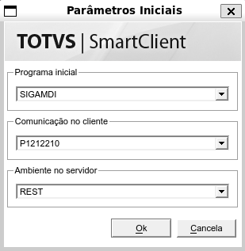

# Configurando ambiente Protheus no WSL

## Smartclient

### Pré-requisitos

- Para executar o smartclient linux, faça o download da versão latest do arte com o comando abaixo:

```bash
wget --user 'Seu usuário' --password 'Sua Senha' https://arte.engpro.totvs.com.br/tec/smartclient/harpia/linux/64/latest/smartclient.tar.gz
```

- Crie a pasta /home/totvs/smartclient com o comando:

```bash
mkdir -p ~/totvs/smartclient
```

- Extraia o arquivo baixado, usando o comando:

```
tar -xf smartclient.tar.gz -C ~/totvs/smartclient/
```
- Crie o arquivo smartclient.ini na pasta /home/totvs/smartclient com o conteúdo de acordo com suas configurações do ambiente:

```bash
[config]
lastmainprog=sigamdi
envserver=REST
JavaScriptConsole=1

[drivers]
active=P1212210

[P1212210]
port = 8002
server = localhost

```

- Instale as dependências do smartclient com o comando:

```bash
sudo apt install -y libxcb-icccm4 libxkbcommon-x11-0 libxcb-image0 libxcb-keysyms1 libxcb-randr0 libxcb-render-util0 libxcb-randr0 libxcb-sync-dev libxcb-xfixes0 libsm-dev libxcb-xinput-dev libxcb-glx0 libegl-dev libfontconfig libopengl0 libnss3 libatk1.0-0 libatk-bridge2.0-0 libcups2 libxcomposite-dev libxdamage1 libxrandr2 libpango-1.0-0 libcairo2-dev libasound2 qt6-wayland
```

- Crie também as variáveis de ambiente, conforme abaixo:
    
```bash
echo 'export QT_QPA_PLATFORM=wayland' >> ~/.bashrc
echo 'export export QT_QPA_PLATFORM=xcb' >> ~/.bashrc
```

- Execute o smartclient para verificar se deu tudo certo:
    
```bash
~/totvs/smartclient/smartclient
```

- A tela a seguir deverá ser apresentada:



